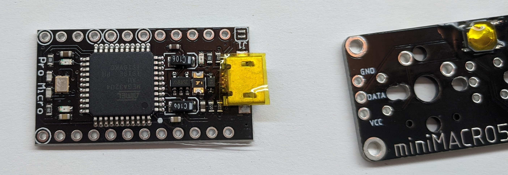

# Assembly
Note that your components may look slightly different, or you may have chosen different components.  For a description of what the miniMACRO5 is, [see the readme](README.md) where you can also find the [bill of materials](README.md##bill-of-materials-bom) can also be found.

The white circuit board in these photos is a version 3b board dated 03/15/2020.  There are minor differences between the v3 and v3b board but these instructions should still work for the most part.

## Check you have all the parts
Check you have everything you require based on the [bill of materials](README.md##bill-of-materials-bom).

## Step 1 - Reset switch and ICSP ports
Step 1: Solder in the reset switch, ICSP ports, and Pro Micro headers (may need to trim the extra header length). Tape over the USB port to prevent shorts (the assembly is pretty tight).

## Step 2 - Pro Micro Headers onto miniMACRO5

## Step 3 - Insulate the USB port
There is not much clearance between the micro USB socket and other components on the board.  Insulate the USB socket by covering it with tape.

## Step 4 - Add rotary encoders

## Step 5 - Install switches

## Step 6 - Solder Pro Micro to Pro Micro Headers

## Step 7 - Mount components into case

## Step 8 - Program with QMK
The miniMACRO5 runs the [QMK firmware](https://qmk.fm/).  See files at `/firmware/QMKv3/`.

## Step 9 - Enjoy!

Step 2: Install rotaries wherever you want (supports up to 5). They will fit through the standard 14mm square plate hole for Cherry MX switches.

Step 3: Mount the board, press in the Cherry MX switches, and solder

Step 4: Solder in the Pro Micro (USB port is oriented up). Add RGB (WS2812b) to VCC/DATA/GND headers.

