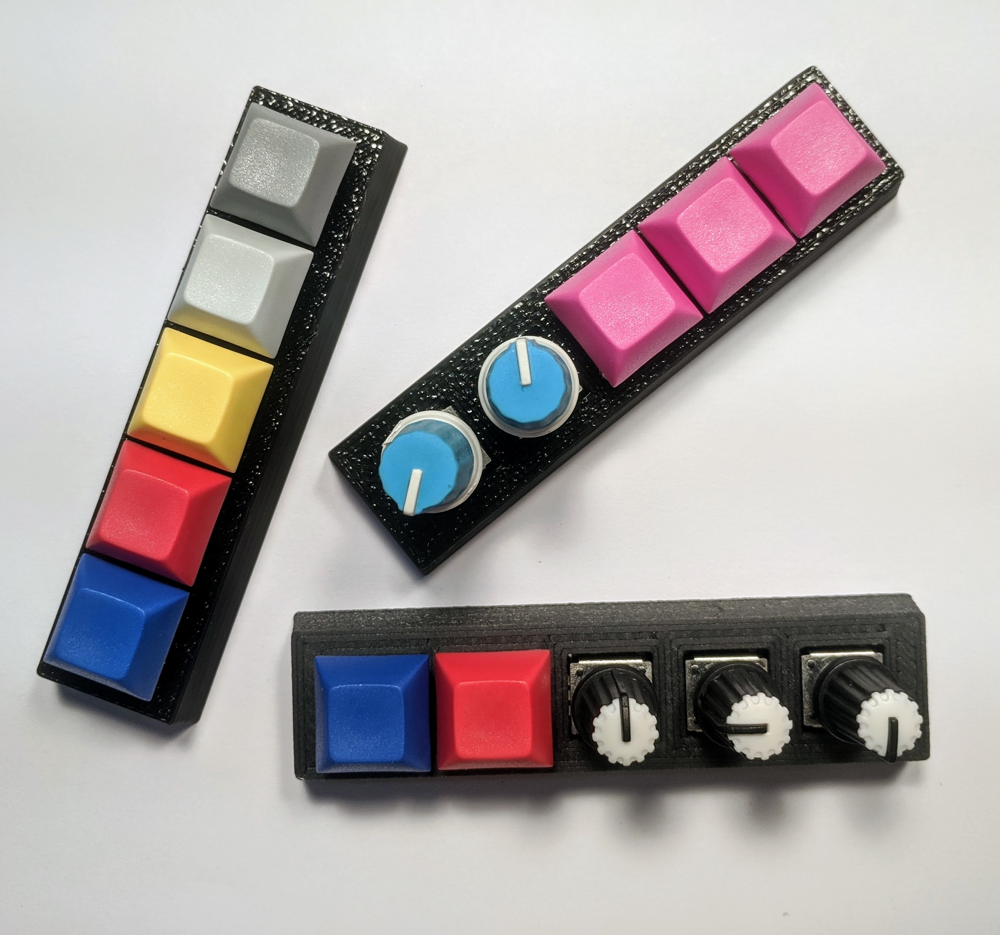
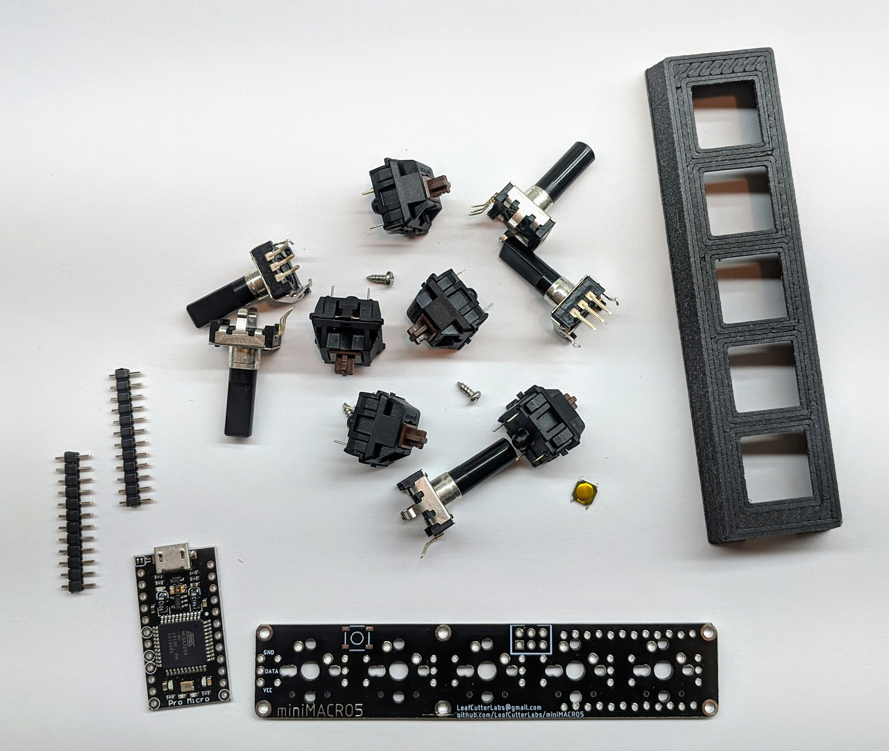
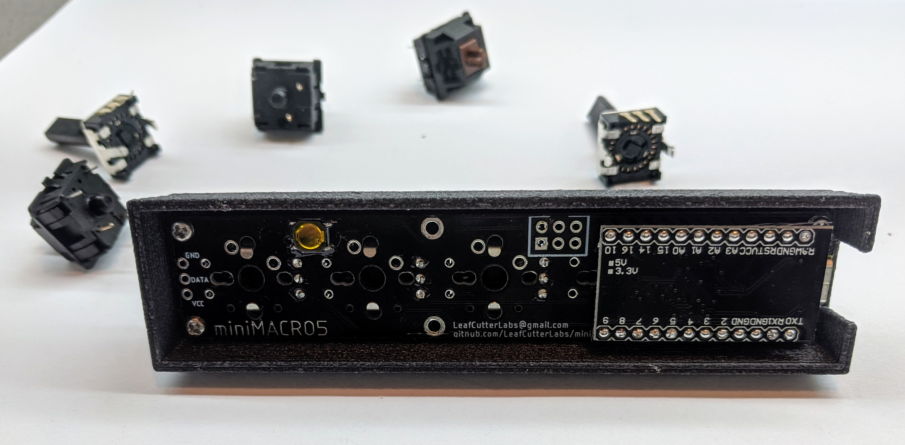

# miniMACRO5
QMK powered macropad based on Arduino Pro Mini with support for up to 5 rotary encoders or 5 mechanical switches and RGB underglow.

 

 <b>BOM:</b>
 1 - Arduino Pro Micro with headers - SparkFun, eBay, Amazon
 2 - Rotary encoders - Bourns Pec12r and Pec11r, Alps, and the cheap chinesse versions have been tested. Any quadrature encocder that fits should work. Supports switch encoders.
 3 - Cherry MX style switches
 4 - Reset switch (optional)
 5 - ICSP headers (optional)
 6 - WS2812 strip for RGB underglow (optional)
 7 - Case (3d printable STL in /hardware) and M2 mounting screws
 <h1>Assembly:</h1>

Step 1: Solder in the reset switch, ICSP ports, and Pro Micro headers (may need to trim the extra header length). Tape over the usb port to prevent shorts (the assembly is pretty tight).

Step 2: Install rotaries wherever you want (supports upto 5). They will fit through the standard 14mm sqaure plate hole for Cherry MX switches.

Step 3: Mount the board and press in the Chrry MX keys and solder

Step 4: Solder in the Pro Micro (USB port is oriented up). Add RGB (WS2812b) to VCC/DATA/GND headers.

Step 5: Program with QMK (look in /firmware/QMKv3/) and enjoy

