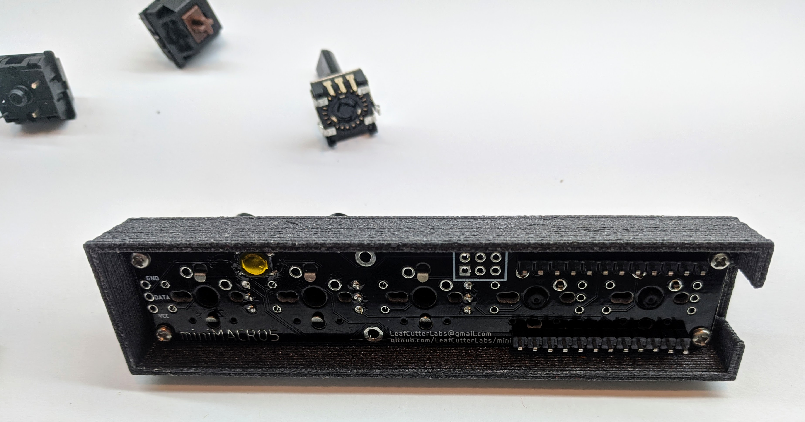

# miniMACRO5
QMK-powered macropad based on Arduino Pro Micro. Supports a mix of up to 5 rotary encoders or mechanical switches with optional RGB underglow.

 

## Bill of materials (BOM)
### Required components
1. Arduino Pro Micro with headers - available from SparkFun, eBay, Amazon, etc.
2. Rotary encoders - Bourns PEC12R and PEC11R, Alps, and the cheap Chinese versions have been tested. Any quadrature encocder that fits should work. Supports switch encoders.
3. Cherry MX-style switches
4. Keycaps for your chosen switches
5. Case (3d printable STL in `/hardware`)
6 - 4x 4mm M2 mounting screws

### Optional components
1. Reset switch
2. ICSP headers (only required to flash the Arduino if the Caterina bootloader is not present)
3. WS2812 strip for RGB underglow)

# Assembly

Step 1: Solder in the reset switch, ICSP ports, and Pro Micro headers (may need to trim the extra header length). Tape over the USB port to prevent shorts (the assembly is pretty tight).

Step 2: Install rotaries wherever you want (supports up to 5). They will fit through the standard 14mm square plate hole for Cherry MX switches.

Step 3: Mount the board, press in the Cherry MX switches, and solder

Step 4: Solder in the Pro Micro (USB port is oriented up). Add RGB (WS2812b) to VCC/DATA/GND headers.

Step 5: Program with QMK (look in /firmware/QMKv3/) and enjoy!

